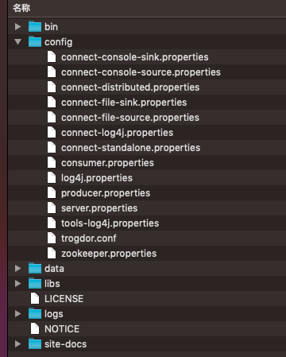

### kafka 介绍

[官网](http://kafka.apache.org/)  

[文档](http://kafka.apache.org/0110/documentation.html)

简介：  
```
Apache Kafka® is a distributed streaming platform. What exactly does that mean?  
（Apache Kafka 是一个分布式的流处理平台）  
A streaming platform has three key capabilities:  
（流处理平台有三个关键特性）  
Publish and subscribe to streams of records, similar to a message queue or enterprise messaging system.  
（发布和订阅记录流，类似于消息队列或企业消息传递系统）  
Store streams of records in a fault-tolerant durable way.  
（以容错的持久方式存储记录流）  
Process streams of records as they occur.  
（处理记录流）  
Kafka is generally used for two broad classes of applications:  
（Kafka 通常用于两大应用）  
Building real-time streaming data pipelines that reliably get data between systems or applications  
（构建实时数据流管道，以可靠地在系统或应用程序之间获取数据）  
Building real-time streaming applications that transform or react to the streams of data  
（构建实时流应用程序以转换或响应数据流）  

```

##### 名词介绍

**消息**  

  

**主题** 


**分区和副本**


**leader-follower** 


**broker** 


**生产者消费者** 


**isr** 


**zookeeper** 


**某一集群架构图** 


**结构目录**  
  
`bin`目录下存放一些可执行的命令文件: server相关命令、生产者相关命令、消费者相关命令等  
`config`目录主要是存放一些配置文件,其中`server.properties`是主要配置文件 [详情请见-->](/mq/KAFKA_CONFIG.MD)  
`logs`目录下面是存放server产生的`日志`和存放在kafka中的`数据`(生产者发送到kafka中的数据会做落盘处理保存一段时间)  
需要注意的是配置文件中`log.dirs`这个配置是设置数据存放的位置的可以配置成`数据和系统日志分离`

**kafka和zookeeper关系**
```text
Kafka 严重依赖于 Zookeeper 集群，所有的 Broker 在启动的时候都会往 Zookeeper 进行注册，目的就是选举出一个 Controller。

这个选举过程非常简单粗暴，就是一个谁先抢到谁就当，不涉及什么算法问题。

那成为 Controller 之后要做啥呢，它会监听 Zookeeper 里面的多个目录，例如有一个目录 /brokers/，其他从节点往这个目录上**注册（就是往这个目录上创建属于自己的子目录而已）**自己。

这时命名规则一般是它们的 id 编号，比如 /brokers/0,1,2。注册时各个节点必定会暴露自己的主机名，端口号等等的信息。

此时 Controller 就要去读取注册上来的从节点的数据（通过监听机制），生成集群的元数据信息，之后把这些信息都分发给其他的服务器，让其他服务器能感知到集群中其它成员的存在
```

**isr中的broker何时被踢出**  
主要是两个配置  
`replica.lag.max.messages`：根据副本同步消息的量（0.9版本中该属性被移除）  
`replica.lag.time.max.ms`：根据同步的时间，慢于这个时间将被移出isr 

**kafka数据有序性**  
分区内有序

**分区内副本对消费者的数据一致性**  
  
hw:高水位是对消费者可见的消息  
leo:是leader最高写入的消息位置  
当发生leader的更替的时候所有的副本需要从hw位置截掉，再从新从leader拉取数据。


**版本更新**  
`0.9`版本之前KAFKA消费者的偏移量存储在zookeeper中，之后的版本存储在KAFKA中`__concumer_offset`这个主题中  
`0.11`版本引入的新特性`幂等性`、`事务`

**负载**  
分区可以提高负载和并发消费  
**高可用**  
副本可以提升高可用性  

**KAFKA高速读写**  
1、零拷贝  
2、顺序写磁盘  
3、分布式  

[好文推荐 -->](https://blog.csdn.net/u013573133/article/details/48142677)  
[性能调优](https://www.jianshu.com/p/f62099d174d9)
