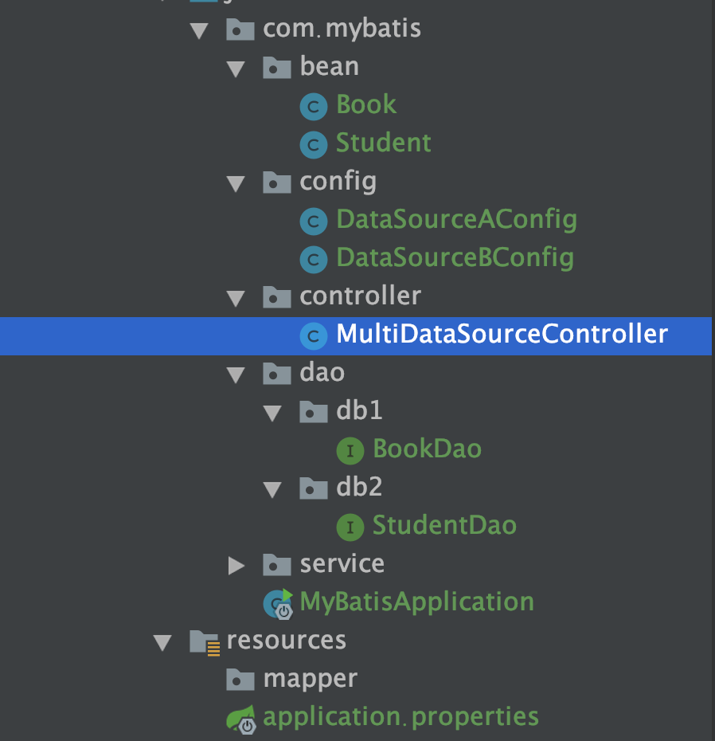

## springboot + mybatis 多数据源配置

### 1. 创建springboot项目
添加依赖
```
		<dependency>
			<groupId>org.springframework.boot</groupId>
			<artifactId>spring-boot-starter-web</artifactId>
		</dependency>

		<dependency>
			<groupId>org.mybatis.spring.boot</groupId>
			<artifactId>mybatis-spring-boot-starter</artifactId>
			<version>1.3.2</version>
		</dependency>

		<dependency>
			<groupId>mysql</groupId>
			<artifactId>mysql-connector-java</artifactId>
		</dependency>
```
application.properties的配置

```mybatis.config-location=classpath:mapper/*.xml
   
   
   #主数据源
   spring.datasource.db1.driver-class-name = com.mysql.jdbc.Driver
   spring.datasource.db1.jdbc-url = jdbc:mysql://localhost:3306/mytest?useUnicode=true&characterEncoding=UTF-8&useSSL=false
   spring.datasource.db1.username = root
   spring.datasource.db1.password = 123456
   #数据源2
   spring.datasource.db2.driver-class-name = com.mysql.jdbc.Driver
   spring.datasource.db2.jdbc-url = jdbc:mysql://localhost:3306/hello?useUnicode=true&characterEncoding=UTF-8&useSSL=false
   spring.datasource.db2.username = root
   spring.datasource.db2.password = 123456
```

### 2. 创建表和对应实体类

```
use mytest;

create table book
(
   id            int not null AUTO_INCREMENT COMMENT '主键',
   name          varchar(50) COMMENT '书名',
   author        varchar (100) COMMENT '作者',
   publishDate   timestamp NOT NULL DEFAULT CURRENT_TIMESTAMP COMMENT '发布时间',
   primary key (id)

)DEFAULT CHARSET=utf8;
alter table book COMMENT '图书信息';
```
```
use hello;

create table student
(
   id            int not null AUTO_INCREMENT COMMENT '主键',
   sname         varchar(50) COMMENT '学生名',
   age           int COMMENT '年龄',
   primary key (id)

)DEFAULT CHARSET=utf8;
alter table student COMMENT '学生信息';
```

### 3. 配置文件（重要步骤！！）

需要注意的是要加`@Primary`,因为`SqlSessionFactory`我们自己创建，所以一些配置直接写在`application.properties`中会不生效，需要在创建`SqlSessionFactory`的时候设置`Configuration`比如代码中的开启驼峰

```
@Configuration
@MapperScan(basePackages = "com.mybatis.dao.db1", sqlSessionTemplateRef = "sqlSessionTemplate1")
public class DataSourceAConfig {

  /**
   * 配置数据源，.
   * @return
   */
  @Bean("dataSource1")
  @ConfigurationProperties(prefix = "spring.datasource.db1")
  @Primary
  public DataSource testDataSource() {
    return DataSourceBuilder.create().build();
  }

  @Bean("sqlSessionFactory1")
  @Primary
  public SqlSessionFactory getSqlSessionFactory(@Qualifier("dataSource1") DataSource dataSource)throws Exception {
    SqlSessionFactoryBean bean = new SqlSessionFactoryBean();
    bean.setDataSource(dataSource);
    //bean.setMapperLocations(new PathMatchingResourcePatternResolver().getResources("classpath:mybatis/mapper/db1/*.xml"));
    return bean.getObject();
  }

  @Bean(name = "transactionManager1")
  @Primary
  public DataSourceTransactionManager testTransactionManager(@Qualifier("dataSource1") DataSource dataSource) {
    return new DataSourceTransactionManager(dataSource);
  }

  @Bean(name = "sqlSessionTemplate1")
  @Primary
  public SqlSessionTemplate testSqlSessionTemplate(@Qualifier("sqlSessionFactory1") SqlSessionFactory sqlSessionFactory) throws Exception {
    return new SqlSessionTemplate(sqlSessionFactory);
  }

}
```

```
@Configuration
@MapperScan(basePackages = "com.mybatis.dao.db2", sqlSessionTemplateRef = "sqlSessionTemplate2")
public class DataSourceBConfig {


  /**
   * 配置数据源，.
   * @return
   */
  @Bean("dataSource2")
  @ConfigurationProperties(prefix = "spring.datasource.db2")
  public DataSource testDataSource() {
    return DataSourceBuilder.create().build();
  }

  @Bean("sqlSessionFactory2")
  public SqlSessionFactory getSqlSessionFactory(@Qualifier("dataSource2") DataSource dataSource)throws Exception {
    SqlSessionFactoryBean bean = new SqlSessionFactoryBean();
    bean.setDataSource(dataSource);
    return bean.getObject();
  }

  @Bean(name = "transactionManager2")
  public DataSourceTransactionManager testTransactionManager(@Qualifier("dataSource2") DataSource dataSource) {
    return new DataSourceTransactionManager(dataSource);
  }

  @Bean(name = "sqlSessionTemplate2")
  public SqlSessionTemplate testSqlSessionTemplate(@Qualifier("sqlSessionFactory2") SqlSessionFactory sqlSessionFactory) throws Exception {
    return new SqlSessionTemplate(sqlSessionFactory);
  }


}
```
目录结构




