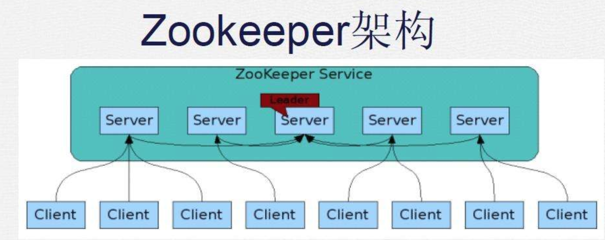

### zookeeper  
    ZooKeeper是一个分布式的，开放源码的分布式应用程序协调服务，是Google的Chubby一个开源的实现，是Hadoop的重要组件
#### 主要解决的问题  
它主要是用来解决分布式应用中经常遇到的一些数据管理问题，如：统一命名服务、状态同步服务（分布式锁）、集群管理、分布式应用配置项的管理、负载均衡、分布式队列等。

#### java客户端  
`org.apache.zookeeper.zookeeper`、`zkclient`、`curator`

#### zk中的角色  

1. leader：领导者负责进行投票的发起与决议，更新系统状态，写数据，查看数据  
2. follower：用于接收客户端请求并向客户端返回结果，在选举过程中参与投票  
3. observer：可以接收客户端连接，将写请求转发给leader节点，但observer不参与投票过程，只同步leader的状态。observer的目的是为了扩展系统，提高读写速度  

  

Zookeeper是一个由多个server组成的集群  
一个leader，多个follower  
每个server保存一份数据副本  
全局数据一致  
分布式读写  
更新请求转发，由leader实施  

#### 数据模型  
每一个数据节点都被称作一个ZNode所有ZNode按层次化结构进行组织，形成一棵树。开发人员可以向这个节点中写入数据，也可以在下面创建子节点。  

#### 节点类型  
4种节点类型:  
**持久节点**：`zookeeper`中最常见都一种节点，该类型节点被创建之后，就会一直存在于`zookeeper`服务器上，直到有删除操作主动清除这个节点。  
**持久顺序节点**：基本特性和持久节点保持一致。额外特性体现在顺序性上，在`zookeeper`中，每个父节点都会为它的第一级子节点维护一份顺序，用于记录下面每个子节点创建的先后顺序。基于这个特性，在创建子节点的时候，可以设置这个标记，那么在创建节点过程中，zookeeper会自动为给定节点名上加一个数字后缀，作为一个新的、完整的节点名。另外需要注意的是，这个数字后缀的上限是整型的最大值。  
**临时节点**：和持久节点不同的是，临时节点的生命周期和客户端的会话绑定在一起，也就是说，如果客户端会话失效，那么这个节点会被自动清理掉。注意，这里提到的是客户端会话失效，而非TCP链接断开。另外zk规定了不能基于临时节点来创建子节点，也就是说临时节点只能作为叶子节点。  
**临时顺序节点**：和临时节点基本特性一致，只是加上来顺序的特性。  

#### 状态信息  
  
可以看见图中通过`get`命令获取了`wpqTestNode`节点的状态信息。    
其中version是用来实现乐观锁的，类似mysql的`mvcc`.  

| 状态属性 | 说明 |
| ---- | ---- |
|   cZxid   | 当前节点事务id   |
|   ctime   | 当前节点创建时间   |
|   mZxid   |    |
|   pZxid   |    |
|   cversion   | 当前数据节点子节点的版本号   |
|   dataVersion   | 当前数据节点数据内容的版本号   |
|   aclVersion   | 当前数据节点ACL变更的版本号   |
|   aclVersion   | 当前数据节点ACL变更的版本号   |

#### 事务ID  
在`zookeeper`中，事务是指能够改变zookeeper服务器状态的操作，我们也成为事务操作或者更新操作。一般包括数据节点的创建和删除、数据节点内容更新和客户端会话创建与失效操作。对于每个事务请求，zookeeper会为其分配一个全局唯一的事务ID，用ZXID来表示，通常是64位的数字，每一个ZXID对应一次更新操作，从这些ZXID中可以间接地识别出zookeeper处理这些更新操作请求的全局顺序。

#### ACL(Access Control List)访问控制列表  
在`Unix/Linux`文件系统中是使用的权限控制方式是 -- `UGO(User、Group、Other)`,`UGO`就是针对一个文件或者目录，对创建者，创建者所在对组和其他用户分别配置不同的权限，可以看出来这样的粒度比较粗。相比较之下我们可以从三个方面来理解`ACL`机制：  
**1. 权限模式（Scheme）**  

权限模式用来确定权限验证过程中使用的检验策略，在zookeeper中开发人员使用最多的是一下四种权限模式  

|权限模式| 授权对象|
|----|----|
|`IP`| 通常是一个IP地址或者是IP段，例如 `192.168.1.110` 或 `192.168.1.1/24`|
|`Digest`| 自定义，通常是：`username:BASE64(SHA-1(nsername:password))`|
|`World`| 只有一个ID ： "anyone"|
|`Super`| 与Digest模式一致|

**2. 授权对象（ID）**  
见上  
**3. 权限（Permission）**  
在zookeeper中操作权限可以分为五大类  

|权限字段| 说明|
|----|----|
|CREATE(C)| 数据节点的创建权限，允许授权对象在该数据节点下创建子节点|
|DELETE(D)| 子节点的删除权限|
|READ(R)| 数据节点的读取权限，允许访问数据节点，读取数据，读取子节点列表|
|WRITE(W)| 数据节点的更新权限|
|ADMIN(A)| 数据节点的管理权限，允许授权对象对该数据节点进行ACL相关对设置操作|

#### 工作原理  

[zab协议](https://blog.csdn.net/jin5203344/article/details/53142027)  

#### 选举流程  

[好文推荐](https://www.cnblogs.com/sunddenly/articles/4143859.html)

#### 序列化  
`Jute`自行了解